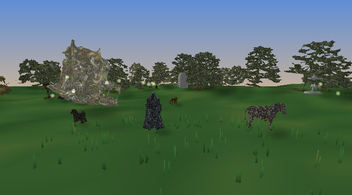
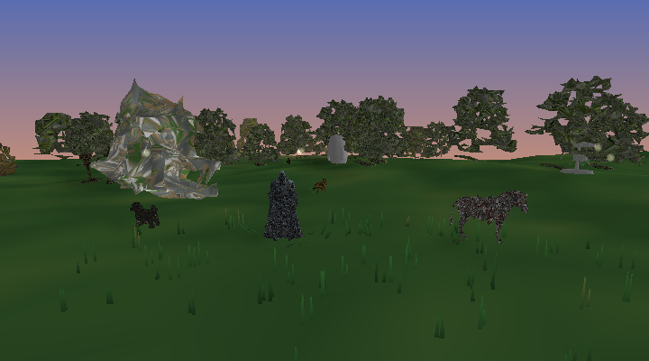

# Tellus

**A 3D engine for the terminal — and the small shared worlds that run on it.**

Tellus renders real-time, truecolour 3D over SSH. A CPU software rasterizer paints
into an RGB framebuffer; a terminal presenter packs it into Unicode sub-pixel cells
and streams minimal ANSI deltas — so anyone with an ssh client can walk around a
shared world, no GPU, no browser, no install.




*Both frames are real renders from the MMO's framebuffer — what a terminal shows,
before the octant cell fitting.*

## Try it

```bash
ssh -p 4020 <host>     # Tellus MMO — a shared meadow: run around, meet other players
ssh -p 4010 <host>     # SSH sailing — single-handed dinghy sailing
```

## The monorepo

```
packages/
  engine/     @tellus/engine — the terminal-native 3D engine (the heart of the repo)
apps/
  mmo/        the flagship: a shared 3D world over SSH, worker-pool rendering
  sailing/    the first game: dinghy sailing with Gerstner-ish waves, same engine
  server/     WebSocket world server for the browser experiment
  client/     Vite + React Three Fiber browser client (the original prototype)
packages/
  protocol/   wire contract for the browser experiment (messages, binary codec)
  world/      shared movement integrator + ECS + spatial hash for the browser experiment
  assets/     pulls models from the Flobots asset manager into a runtime manifest
```

Two generations live side by side: the **browser experiment** (client/server/protocol/world)
came first and taught us the netcode; the **terminal engine** (`packages/engine`) and its
games are where the project lives now.

### How a frame happens (the SSH games)

```
World state ──► WorldRenderer ──► RasterTarget ──► Screen cells ──► ANSI delta ──► ssh
   (shared)      sky · terrain      RGB + depth       octant 2×4        only what      client
                 grass · props      framebuffer       sub-pixels        changed
                 shadows · agents
```

- **One process, one world**: every SSH session is a player in the same world.
- **Worker-pool rendering**: frames rasterize on worker threads (one world copy per
  worker, agents shipped as tiny snapshots), so input never blocks and players
  render in parallel across cores.
- **Determinism as a feature**: the world builds identically everywhere from seeds,
  which is what makes stateless render workers — and byte-identical parity tests — possible.

## Internal packages are source

`@tellus/*` packages are consumed as raw TypeScript (`main: ./src/index.ts`, no build
step). Change the engine and every game is instantly typed against the change.

## Develop

```bash
pnpm install
pnpm typecheck                        # all workspaces
pnpm test                             # includes the render-worker parity test
pnpm --filter @tellus/mmo dev         # run the MMO locally (port 4020)
pnpm --filter @tellus/sailing dev     # run sailing locally (port 4010)
```

Each SSH game generates its own host key on first run (it prints the exact
`ssh-keygen` command). Keys live in `apps/<game>/assets/` and are gitignored.

See [CONTRIBUTING.md](CONTRIBUTING.md) for the layout tour, and the per-package
READMEs for depth: [engine](packages/engine/README.md) ·
[mmo](apps/mmo/README.md) · [sailing](apps/sailing/README.md).

## Models

World models come from the [Flobots 3D Asset Manager](https://3d.flobots.xyz),
compiled to LOD meshes + baked textures by `packages/engine/tools/compile-glb.mjs`.
The MMO ships its compiled meshes in-repo so it runs out of the box;
`apps/mmo/tools/convert-all.mjs` regenerates them from source models.

## License

[MIT](LICENSE)
